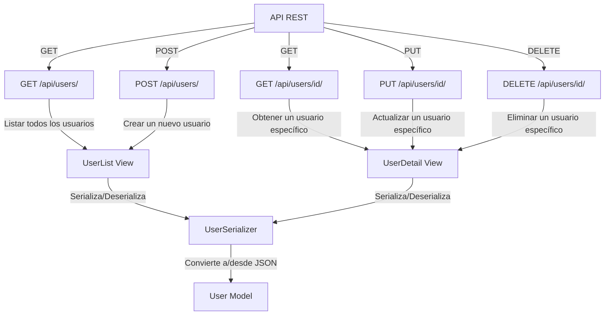
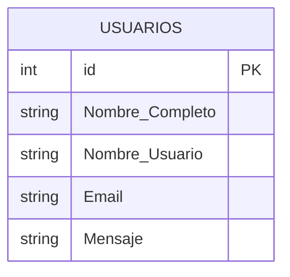

# Aprendizaje Autónomo 2

Ejercicio de Microservicios con Django, SQLite y React

##  Objetivo del Ejercicio
- Crear una API REST con Django (utilizando Django REST Framework) conectada a SQLite.
- Trabajar únicamente con un modelo simple (por ejemplo, un modelo de Usuarios).
- Así, el estudiante comprenderá los fundamentos de: 
- Cómo configurar una base de datos SQLite en Django
- Cómo exponer endpoints (GET y POST) con Django REST Framework.
- Cómo consumir esos endpoints desde un frontend en React.

##  Diagrama APIRest


##  Diagrama UML 


## Diagrama de Carpetas

```mermaid


```

##  Ejecucion 

