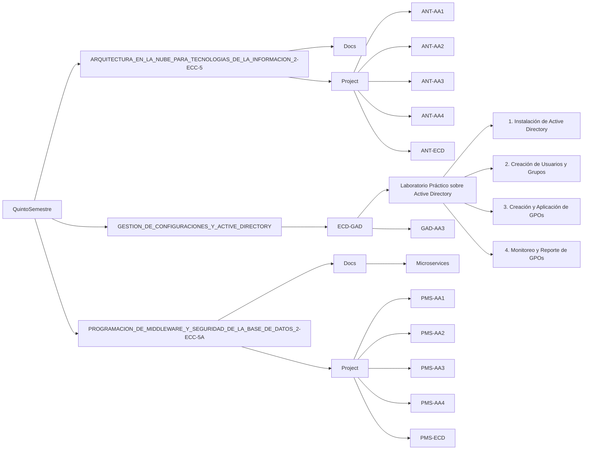

# Apuntes del Quinto Semestre

##  Materias
  - ARQUITECTURA EN LA NUBE PARA TECNOLOGIAS DE LA INFORMACION 2-ECC-5A (UIDE/QuintoSemestre/ARQUITECTURA_EN_LA_NUBE_PARA_TECNOLOGIAS_DE_LA_INFORMACION_2-ECC-5)
  - GESTION DE CONFIGURACIONES Y ACTIVE_DIRECTORY (UIDE/QuintoSemestre/GESTION_DE_CONFIGURACIONES_Y_ACTIVE_DIRECTORY)
  - PROGRAMACION DE MIDDLEWARE Y SEGURIDAD DE LABASE DE DATOS (UIDE/QuintoSemestre/PROGRAMACION_DE_MIDDLEWARE_Y_SEGURIDAD_DE_LA_BASE_DE_DATOS_2-ECC-5A/)

##  Diagrama Structura de archivos
- PROGRAMACION_DE_MIDDLEWARE_Y_SEGURIDAD_DE_LA_BASE_DE_DATOS_2-ECC-5A
  - *_Docs/Microservices_:* En esta carpeta se documentará la información teórica de la materia, sirviendo como un sistema para mantener visibles los apuntes. La visibilidad de estos archivos se gestiona mediante Docusaurus, un marco de documentación de código abierto, lo que permite aprender a utilizar esta tecnología para la redacción de documentación en proyectos reales.
  - *_Project:_* En esta carpeta se cargan las verciones de los Autonomos que se bayan creando como baya la materia, Programacion de Middleware Seguridad(PMS), Aprendizaje Autónomo(AA#).

- ARQUITECTURA_EN_LA_NUBE_PARA_TECNOLOGIAS_DE_LA_INFORMACION_2-ECC-5
  - *_Docs:_* Apuntes sobre la materia que pueden ser relevantes
  - *_Project:_*  Archivos LaTex de los apuntes de las clase.

### Diagrama de carpeta

